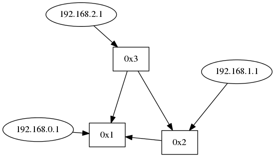

# レポート課題(topology)
## 課題内容

- ホストの接続関係を表示するようtopologyを改造する。
- パケットを出したホストのIPアドレスを楕円で表示する。

## tremaのダウングレード
[handai-trema/syllabusのissue #18](https://github.com/handai-trema/syllabus/issues/18)にあるように最新版のTremaでは正しく動作しないため、Tremaをバージョン0.8.0にダウングレードした。
ダウングレードはGemfileを下記のように変更したのち、`bundle install --binstubs`を実行することにより行う。

```
4c4
< gem 'trema'
---
> gem 'trema', '0.8.0'
```

## ホストの接続関係を表示するようtopologyを改造する
topology_controller.rbにおいて、ホストの接続関係をlldp以外のパケットから取得して、Topologyクラスのインスタンス変数hostsに格納している。
これをgraphviz.rbから参照できるようにtopology.rbにおいて、以下のようにメソッドattr_readerを用いてインスタンス変数hostsのアクセサメソッドを定義する。

```
attr_reader :hosts
```

## パケットを出したホストのIPアドレスを楕円で表示する
画像の出力を行っているlib/view/graphviz.rbのメソッドupdateに以下のように命令を追記し、パケットを出したホストのIPアドレスを楕円で表示する。
ここでは、ノードの追加とリンクの追加をひとまとめに行っている。

```
19a20,26
> 	# hosts
> 	hosts = topology.hosts.each_with_object({}) do |each, tmp|
> 	  tmp[each] = gviz.add_nodes(each[1].to_s, shape: 'ellipse')
> 	  dpid = each[2]
> 	  next unless nodes[dpid]
> 	  gviz.add_edges tmp[each], nodes[dpid]
> 	end
```

## 動作確認
以下のようにtopology_controller.rbを実行する。

```
./bin/trema run ./lib/topology_controller.rb -c triangle_with_host.conf -- graphviz /tmp/topology.png
```

その後、別の端末から以下のようにパケットを送信した。

```
./bin/trema send_packets -s host1 -d host2
./bin/trema send_packets -s host2 -d host3
./bin/trema send_packets -s host3 -d host1
```

数分待つと以下のような画像が得られ、各スイッチに接続するホストが表示されており、プログラムが正しく動作していることがわかる。


